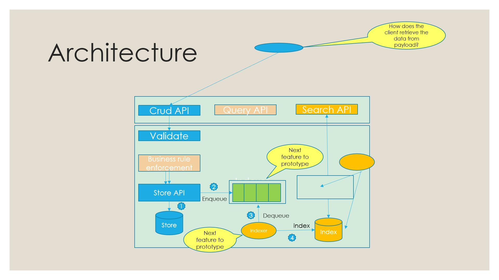
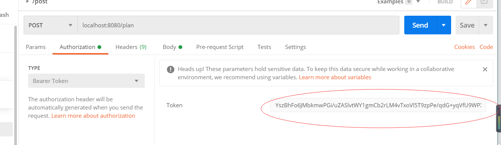
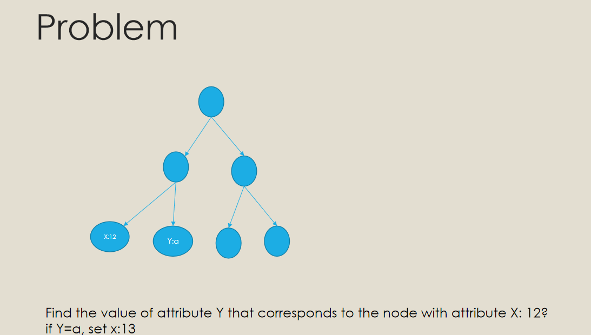
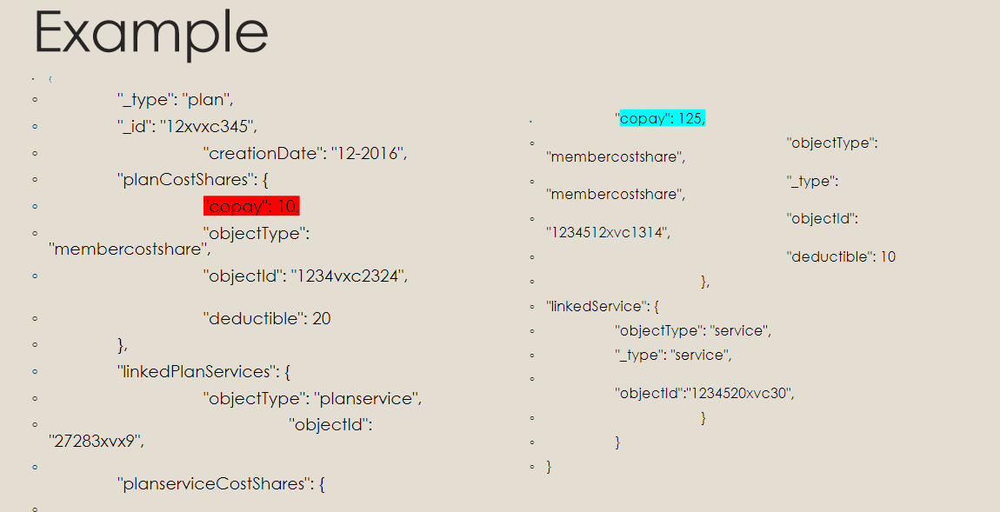

# Advance Bigdata Architercture and Indexing Techniques - INFO7255

Microservice Healthcare Project Introduction  
Professor: Marwan Sabbouh  

## Content list

- [Background](#Background)  
- [Install](#install)  
- [Maintainer](#Maintainer)  
- [Contributors](#Contributors)  
- [license](#License)  

## Description
Studies advanced indexing techniques and algorithms for big-data platforms such as Hadoop and NoSQL databases. Covers big-data design and indexing patterns to organize, aggregate, manipulate, and analyze huge amounts of data beyond human scale. Offers students an opportunity to learn advanced techniques to improve the performance and robustness of the advanced big-data programming models. Additional areas of focus include scalable graph databases, advanced indexing, and full-text searching in graph databases.  

## Background  
The product management team wants to build a new information system that implements use cases.  
You were selected as the architect of the information system.  The information system exposes the rest APIs and uses a data store to store data. To meet your tight deadlines, you mandated the use of the data store that is managed by an internal team to your company.  
As a condition to using the data store, the data store development team requested that you specify the number of requests per second (throughput) that the datastore must support. 
How would you go about specifying the throughput that the datastore must support for the successful implementation of your system?  

You need to convince your development team to store a compounded JSON document, such as the use case that you implemented in the project, as separate objects in the key-value store.  
They insist on storing the compounded JSON document as the value of a single key.  
As an architect, you have the authority to specify functional requirements that they must implement.   
What functional requirements do you present to the development team to convince them to store the compounded JSON document as separate objects?  

Your employer decided that they must implement an OAuth provider that implements the majority of the OAuth 2.0 flows.  They nominate you to be the architect of this implementation.  Being wary of the possibility of getting hacked, you decided to mandate some security requirements as part of the OAuth provider implementation.   

# 1. Introduction

## 1.1. Project introduction  
Probably to do something like this, upload a document in JSON format, and pass the verification. After that, you can CURD through the post, put, delete with Patch. And use Etag to check whether the data is updated. This document will be stored in Redis. Then use The parent-child document is imported into ES, and it can be retrieved through RESTFUL of ES. Among them, because the speed of storing into Redis is much faster than the speed of importing Index, it is necessary to add a queue between StoreAPI and Index to cache.
At the same time, Oauth2.0 and JWT need to be used to complete the security verification, and RS256 asymmetric algorithm encryption is required here.  

In the process of continuous development of the system, if there are too many resources stored in the system, each time you modify it, you want to achieve a partial update instead of the entire document update. At this time, you want to use Patch to achieve a partial update, which is a very economical Resource.   
However, when we store it, compounded JSON document as the value of a single key. In this case, it is very difficult to patch.  
However, if we use to store a compounded JSON document, such as the use case that you implemented in the project, as separate objects in the key-value store. In this case, it is very easy to implement the Patch function.  
And, in the future to realize the search function, it will be easier for us to apply Elasticsearch's parent-child documents.  
he advantages that parent-child has over nested objects are as follows:  
The parent document can be updated without reindexing the children.  
Child documents can be added, changed, or deleted without affecting either the parent or other children. This is especially useful when child documents are large in number and need to be added or changed frequently.  
Child documents can be returned as the results of a search request.  

## 1.2. System Architecture  

### Architecture diagram  



## 1.3. Technical selection  

### Notice  
1. The use case is used for testing, and an object is determined by the ID and type of the use case. The json document is in a nested structure, and json contains properties in nested json format.  
2.Patch implements partial update. The partial update here refers to, for example, after modifying a part, the original part is retained, and then a new part is added. It is equivalent to merge.  
3.ES is implemented through parent-child documents. Similar to demo3.json  
4. Queue is used to import the json file from the post into ES.  
5. It is best not to use pojo storage, this is extended through json.  

### Important Part

1. The implementation of Elasticsearch. After Elasticsearch creates the mapping, it can be retrieved in the retrieval library of ES after performing curd and patch through postman. It should be noted here that the model of ES is not a nested format, but a parent-child document format. Upload After success. Query through the parent document, and query the parent document through the child document, etc.  

In addition to storing the use case in redis, you also need to write a different function to (index) index objects (that is, use case), which needs to be called when post localhost:8080/. Or when patching, put When the time. This function needs to decompose the json object, and send an object in a similar format to Elasticsearch. Here you need to consider the parent and child documents, and implement the queue.  

In other words, whenever CURD and patch are used, another function needs to be called to send the new object to the indexing library for storage. We should send the object to elasticsearch's indexing through this queue.  

After Post, put or patch, go to kibana to search, you can see the update of the document.  
Add a queue between redis and ES, because the speed of storing into Redis is much faster than the speed of importing Index, so a queue should be added between StoreAPI and Index to cache.  

2. Modify the encrypted token part, the token here is modified to RS256 algorithm.  

### Introduction to the whole process of the project
The purpose of this project. The purpose is to use the case by parsing the json format file, and use the ObjectId and ObjectType of the json format file as the key, and store it in redis. Then you can use Elasticsearch to search for the id or other attributes (field) in it. , the queue cache needs to be considered when importing the index library.  

When storing, note that the use case contains nested structures, that is, if the use case is regarded as a class, it contains many inner classes. The inner class should also be stored in redis with ObjectId and ObjectType as keys . The purpose is to make it more convenient for patch partial update merge in the future.  

Each unit needs to be stored, and if patch is used to update, the patch needs to retain the original file, that is to say, it can be merged.  

#### Step

1. Use spring security to complete the authentication of oauth2.0, you need to use jwt, you need to get the token, and then use the token to log in. To get the token, use get localhost:8080/token to get it. After getting it, add it here in other requests token  

In the following curd, except for deletion and post, localhost:8080 is used, and everything else is implemented by localhost:8080/{id}  



2. Verify json schema  
use case is a class in json format. It contains ObjectId and ObjectType. Together they are equivalent to ID.  
Generate json schema through use case. It has also been generated by tools that automatically generate json schema online, and placed under resource.  
Validate the format of the use case by using json schema to validate the use case.  


3. After the verification is passed, use redis to store the use case. The way of storage is not to store the document directly, but to parse the use case that needs to be stored first, because this is a composite json format file. The external class also Some classes are nested, and these classes are stored in json format. Therefore, when saving, you need to parse the json file, and store the nested json format files containing ObjectId and ObjectType separately for future use. Patch provides conditions for merge and Elasticsearch for search. Recursion can be used here.  
The redis port is the default port.  
Can be defined in the yml file  
spring.redis.host=127.0.0.1  
spring.redis.port=6379  

4. Use postman to complete post/get/delete/patch/put functions  
4.1 Submit plan through post. The format of plan is json. Post link localhost:8080/plan/  
If not passed, return 400 and write JSON Schema not valid!  
If passed, return 200, and return the ID of the UUID.  
4.2 Get back the json information of the previous post through get.  
After get is the ID generated by UUID. The link is as follows localhost:8080/plan/{id}  
4.3 Delete localhost:8080 via delete  
Use the previous UUID and type, put it in the request body in json format, to delete or submit a payload in json format, to find the corresponding object to delete
When using the GET method to get the ID again, it returns 404  
4.4 Update by put  
put update complete returns 200  
And you can check the effect after the update through GET  
4.5 Complete local modification through patch  
For local modification here, the original data needs to be preserved. For example, modifying the content of an object is equivalent to doing a merge, and both contents should be saved.  

5. Use Etag to complete the function of state code 302 NOT MATCH  
It can be done by adding an interceptor under the startup class  

```java
@Bean  
public Filter filter(){  
    ShallowEtagHeaderFilter filter= new ShallowEtagHeaderFilter();  
    return filter;  
}  
```

But if you need to implement the Etag under the patch and put functions, you need to calculate the Etag yourself and implement the function  
The encryption method adopted here should be asymmetric encryption, RS256  
  
6. Complete the search function of Elasticsearch. Here you need to consider the problem of queues.  
Elasticsearch imports mapping, then uploads and updates the use case through post, put, and patch, and imports the index library in the form of parent-child documents. Queue cache is added in the middle. The local update (merge) is completed through the patch of postman. After patch merge, then in the index library Query, you can see the updated situation.  
The ES query here needs to check the parent document as well as the child document.  

The following two natural paragraphs have been written in the requirements  
In addition to storing the use case in redis, you also need to write a different function to (index) index objects (that is, use case), which needs to be called when post localhost:8080/. Or when patching, put When the time. This function needs to decompose the json object, and send an object in a similar format to Elasticsearch. Here you need to consider the parent and child documents, and implement the queue.  
In other words, whenever CURD and patch are used, another function needs to be called to send the new object to the indexing library for storage. We should send the object to elasticsearch's indexing through this queue.  

About the ElasticSearch  
You can see that I have used Kibana to run elastic search queries, first creating mappings and defining relationships between objects.  
Then, I post the plan, which uses a queuing mechanism behind the scenes to trigger elastic search to create an index for the object.  
After the index is created, an elastic search query is run to get the results.  
Note how the has-child and has-parent queries are used  
Again, a patch operation has to be performed to run the query again and display the updated data  

Also, make sure to implement a parent-child relationship  
https://www.elastic.co/guide/en/elasticsearch/reference/current/parent-join.html  
To do this, you need to demonstrate the following query:  
1. https://www.elastic.co/guide/en-US/elasticsearch/reference/current/query-dsl-has-child-query.html  
2. https://www.elastic.co/guide/en-US/elasticsearch/reference/current/query-dsl-has-parent-query.html  

A queuing system built on redis: http://restmq.com/  
A quick comparison with rabbitMQ: http://www.minvolai.com/blog/2013/10/RabbitMQ-vs-Redis-as-Message-Brokers/rabbitmq-vs-redis-message-broker/  

https://www.elastic.co/blog/managing-relations-inside-elasticsearch  

https://redis.io/commands/rpoplpush  


About others  

Why do you need addressing?  

  



So far we know how to uniquely identify objects in the system  

For search, we figured out how to identify fields in search queries  

However, given a json document, how to handle specific properties in the Json document?  
   Know that a document consists of multiple nested objects.  
The property may appear in multiple objects  


JSON Path  
$.linkedPlanServices[:0].planserviceCostShares._type  

$.linkedPlanServices[?(@._id=27283xvx9)]  

$.planCostShares[copay]  
$.linkedPlanServices[?(@.objectType=='planservice')].planserviceCostShares.copay  

A good example summary: http://goessner.net/articles/JsonPath/index.html#e2  

online tool: https://jsonpath.curiousconcept.com/  

## Use Case  
```json
{

	"planCostShares": {
		"deductible": 2000,
		"_org": "example.com",
		"copay": 23,
		"objectId": "1234vxc2324sdf-501",
		"objectType": "membercostshare"
		
	},
	"linkedPlanServices": [{
		"linkedService": {
			"_org": "example.com",
			"objectId": "1234520xvc30asdf-502",
			"objectType": "service",
			"name": "Yearly physical"
		},
		"planserviceCostShares": {
			"deductible": 10,
			"_org": "example.com",
			"copay": 0,
			"objectId": "1234512xvc1314asdfs-503",
			"objectType": "membercostshare"
		},
		"_org": "example.com",
		"objectId": "27283xvx9asdff-504",
		"objectType": "planservice"
	}, {
		"linkedService": {
			"_org": "example.com",
			"objectId": "1234520xvc30sfs-505",
			"objectType": "service",
			"name": "well baby"
		},
		"planserviceCostShares": {
			"deductible": 10,
			"_org": "example.com",
			"copay": 175,
			"objectId": "1234512xvc1314sdfsd-506",
			"objectType": "membercostshare"
		},
		
		"_org": "example.com",
		
		"objectId": "27283xvx9sdf-507",
		"objectType": "planservice"
	}],


	"_org": "example.com",
	"objectId": "12xvxc345ssdsds-508",
	"objectType": "plan",
	"planType": "inNetwork",
	"creationDate": "12-12-2017"
}
```

## Install  

Check with Technical Interpretation.  

## Related repositories

- [AdvBigdataArch_INFO7255](https://github.com/prashantk016/AdvBigdataArch_INFO7255) — 💌 Prashant Kabra github.  

## Maintainer  

[@Kaidong Shen](https://github.com/KaidongShen).  

## How to contribute  

You are very welcome to join us! [raise an Issue](https://github.com/KaidongShen/Leyou/issues/new) or submit a Pull Request.  

Follow the [Contributor Covenant](http://contributor-covenant.org/version/1/3/0/) code of conduct.  

### Contributors  

Thanks to the following people who participated in the project:  
[@Kaidong Shen](https://github.com/KaidongShen).  

## License  

[KS](LICENSE) © Kaidong Shen  

## @Author  
Kaidong Shen  

## @Reference  
Prashant Kabra (https://github.com/prashantk016)  

