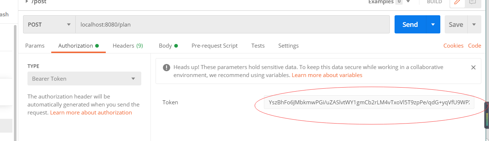

# Advance Bigdata Architercture and Indexing Techniques - INFO7255

Microservice Healthcare Project Introduction
Professor: Marwan Sabbouh

## Content list

- [Background](#Background)  
- [Install](#install)  
- [Maintainer](#Maintainer)  
- [Contributors](#Contributors)  
- [license](#License)  

## Description
研究适用于 Hadoop 和 NoSQL 数据库等大数据平台的高级索引技术和算法。 涵盖大数据设计和索引模式，以组织、聚合、操作和分析超出人类规模的大量数据。 为学生提供学习先进技术的机会，以提高先进大数据编程模型的性能和稳健性。 其他重点领域包括可扩展的图形数据库、高级索引和图形数据库中的全文搜索。  

## Background   
产品管理团队想要构建一个新的信息系统来实现用例。  
您被选为信息系统的架构师。信息系统公开了其余的 API，并使用数据存储来存储数据。为了满足紧迫的最后期限，您要求使用由公司内部团队管理的数据存储。  
作为使用数据存储的条件，数据存储开发团队要求您指定数据存储必须支持的每秒请求数（吞吐量）。  
您将如何指定数据存储为成功实施系统而必须支持的吞吐量？  

您需要说服您的开发团队将复合 JSON 文档（例如您在项目中实现的用例）作为单独的对象存储在键值存储中。  
他们坚持将复合 JSON 文档存储为单个键的值。  
作为架构师，您有权指定他们必须实现的功能需求。  
您向开发团队提出了哪些功能要求以说服他们将复合 JSON 文档存储为单独的对象？  

您的雇主决定他们必须实施一个 OAuth 提供程序来实施大部分 OAuth 2.0 流程。他们提名你成为这个实现的架构师。由于担心被黑客入侵的可能性，您决定将一些安全要求作为 OAuth 提供程序实施的一部分。  

# 1. Introduction

## 1.1. Project introduction  
大概要做这么一个东西, 一个上传JSON格式的文档, 并通过校验. 之后可以通过post, put,delete以 Patch来CURD. 并且用Etag检查数据是否更新. 这个文档会储存再redis里. 然后以父子文档的形式导入到ES中, 通过ES的RESTFUL可以检索. 这其中, 因为存入Redis的速度要远远快于导入Index的速度, 所以要对StoreAPI到Index间加一个queue来缓存.   
这里同时需要使用Oauth2.0 和 JWT来完成安全的校验, 这里需要使用RS256非对称算法加密.  

在系统不断发展的过程中，如果系统中存储的资源过多，每次修改都希望实现局部更新，而不是整个文档更新。这时候想用Patch来实现部分更新，是非常经济的Resource。  
但是，当我们存储它时，复合 JSON 文档作为单个键的值。在这种情况下，很难修补。  
但是，如果我们使用将复合 JSON 文档（例如您在项目中实现的用例）存储为键值存储中的单独对象。在这种情况下，很容易实现 Patch 功能。  
并且，未来实现搜索功能，我们应用Elasticsearch的父子文档会更容易。  
父子对象相对于嵌套对象的优势如下：  
无需重新索引子项即可更新父文档。  
可以添加、更改或删除子文档，而不会影响父文档或其他子文档。当子文档数量很大并且需要经常添加或更改时，这尤其有用。  
子文档可以作为搜索请求的结果返回。  

## 1.2. System Architecture  

### Architecture diagram  

  

## 1.3. Technical selection  

### Notice
1.use case 是用来测试的, 通过use case 的ID和type来确定一个object. 这个json的文档是嵌套结构的, json里面有嵌套json格式的properties.  
2.Patch实现的是局部更新, 这里的局部更新指的是比如修改一部分后, 原来的部分保留, 然后再添加新的部分. 相当于merge.  
3.ES是通过父子文档实现的. 类似demo3.json.  
4.Queue是用来把post上来的json文件导入到ES中的.   
5.最好不要用pojo储存, 这个是通过json扩展的.  

### Important Part

1.Elasticsearch的实现. Elasticsearch创建mapping之后, 通过postman进行curd以及patch之后, 可以在ES的检索库中检索到. 这里需要注意的是, ES的model不是嵌套格式, 而是父子文档格式. 上传成功后. 通过父文档查询, 和通过子文档查询父文档等检索.   
除了把use case储存到redis以外, 还需要写一个不同的function来(索引)index objects(也就是use case), 这个功能需要在post localhost:8080/的时候就被调用. 或者在进行patch, put的时候. 这个功能需要分解这个json object, 并且送一个类似的格式的object到Elasticsearch. 这里需要考虑父子文档, 并且实现队列.   
换句话说, 就是每当, CURD和patch的时候, 需要call另一个function来把这个new object送到索引库储存. 我们应该通过这个queue来把object送到elasticsearch的indexing中.  
Post, put或者patch之后, 再去kibana上检索, 能够看到文档的更新.  
补充在redis和ES中间加一个队列, 因为存入Redis的速度要远远快于导入Index的速度, 所以要对StoreAPI到Index间加一个queue来缓存.   
2.修改加密的token部分, 这里的token修改成RS256算法  

### Introduction to the whole process of the project  
本项目的目的. 目的是通过解析json格式的文件use case, 并且以json格式文件的ObjectId和ObjectType作为key, 储存在redis中. 然后可以使用Elasticsearch进行对其中的id或者其他的属性(field)搜索, 导入索引库的时候需要考虑队列缓存.  

在储存的时候, 注意, use case内包含嵌套结构, 也就是说, 如果把use case看作一个类, 其中包含着很多内部类. 内部类也应该以ObjectId和ObjectType作为key, 储存在redis中. 目的是方便未来进行patch局部更新merge时更方便.  

需要对每一个单元进行储存, 并且如果使用patch进行更新, 需要让patch能够保留原来的文件, 也就是说能够进行merge.   

#### 步骤  

1.使用spring security来完成oauth2.0的认证, 需要使用jwt, 需要获取token, 然后使用token登录. 获取token, 使用get localhost:8080/token来获取. 获取之后, 在其他的请求中的这里加入token  
  
后面的curd中, 除了删除和post是使用localhost:8080, 其他的都是localhos:8080/{id}来实现的  

2. 验证json schema   
use case是一个json格式的类. 里面包含ObjectId和ObjectType. 他们两个一起相当于ID.    
	通过use case生成json schema. 也已经通过网上自动生成json schema的工具生成, 放在了resource下面.   
	通过使用json schema对use case的验证, 来valid use case的格式  

3. 验证通过后, 使用redis储存这个use case. 储存的方式并不是直接把文档进行储存, 而是先解析需要存的use case, 因为这个是一个复合的json格式的文件. 外面的类里也嵌套了一些类, 这些类都是以json格式储存的. 所以, 在保存的时候, 需要解析json文件, 把里面嵌套的包含ObjectId和ObjectType的json格式的文件也要分开储存, 为了未来使用patch进行merge和Elasticsearch进行搜索提供条件. 这里可以用递归.  
redis端口就是默认端口就可以  
可以在yml文件下定义  
spring.redis.host=127.0.0.1  
spring.redis.port=6379  

4. 使用postman, 来完成post/get/delete/patch/put功能  
	4.1 通过post来提交plan. plan格式为json. post 链接localhost:8080/plan/  
		如果未通过, 返回400并且写明JSON Schema not valid!  
		如果通过, 返回200, 并且返回UUID的ID.  
	4.2 通过get来拿回之前post的json信息.   
		get后面是UUID生成的ID. 链接如下 localhost:8080/plan/{id}  
	4.3 通过delete删除 localhost:8080  
使用之前的UUID和type, 以json格式放到请求体中, 来删除或者提交一个json格式的payload, 来找到相应的对象删除  
再次使用GET方法获取ID时, 返回404  
	4.4 通过put来更新  
put更新完成返回200  
并且可以通过GET检查更新之后的效果  
	4.5 通过patch来完成局部修改  
这里的局部修改, 需要保留原来的数据. 比如修改一个object里的内容, 相当于做了一个merge, 两个内容应当都保存起来  

5. 使用Etag来完成 state code 302 NOT MATCH 的功能  
可以在启动类下添加一个拦截器完成  

```java
@Bean  
public Filter filter(){  
    ShallowEtagHeaderFilter filter= new ShallowEtagHeaderFilter();  
    return filter;  
}  
```

但是如果需要实现patch和put功能下的Etag, 需要自己计算Etag并实现功能  
这里采取的加密方式应当是非对称加密, RS256  

6.完成Elasticsearch的搜索功能. 这里需要考虑队列的问题.  
Elasticsearch导入mapping, 然后通过post和put, patch上传更新use case, 以父子文档的形式导入索引库. 中间加队列缓存.通过postman的patch来完成局部更新(merge). patch merge后, 再在索引库中查询, 可以看到更新后的情况.   
这里的ES查询需要查父文档, 也需要查子文档.    

下面两个自然段已经在需求中写了  
除了把use case储存到redis以外, 还需要写一个不同的function来(索引)index objects(也就是use case), 这个功能需要在post localhost:8080/的时候就被调用. 或者在进行patch, put的时候. 这个功能需要分解这个json object, 并且送一个类似的格式的object到Elasticsearch. 这里需要考虑父子文档, 并且实现队列.   
换句话说, 就是每当, CURD和patch的时候, 需要call另一个function来把这个new object送到索引库储存. 我们应该通过这个queue来把object送到elasticsearch的indexing中.  

关于 ElasticSearch  
你可以看到我已经使用 Kibana 运行弹性搜索查询，首先创建映射并定义对象之间的关系。  
然后，我发布计划，它在后台使用排队机制触发弹性搜索为对象创建索引。  
创建索引后，将运行弹性搜索查询以获取结果。  
请注意如何使用 has-child 和 has-parent 查询  
同样，必须执行补丁操作才能再次运行查询并显示更新的数据  

Also, make sure to implement a parent-child relationship  
https://www.elastic.co/guide/en/elasticsearch/reference/current/parent-join.html  
To do this, you need to demonstrate the following query:  
1. https://www.elastic.co/guide/en-US/elasticsearch/reference/current/query-dsl-has-child-query.html  
2. https://www.elastic.co/guide/en-US/elasticsearch/reference/current/query-dsl-has-parent-query.html  

A queuing system built on redis: http://restmq.com/  
A quick comparison with rabbitMQ: http://www.minvolai.com/blog/2013/10/RabbitMQ-vs-Redis-as-Message-Brokers/rabbitmq-vs-redis-message-broker/  

https://www.elastic.co/blog/managing-relations-inside-elasticsearch  

https://redis.io/commands/rpoplpush  


About others  

Why do you need addressing?  

  

  

到目前为止，我们知道如何唯一标识系统中的对象  

对于搜索，我们想出了如何识别搜索查询中的字段  

但是，给定一个 JSON 文档，如何处理 JSON 文档中的特定属性？  
    知道一个文档由多个嵌套对象组成。  
该属性可能出现在多个对象中  

JSON Path  
$.linkedPlanServices[:0].planserviceCostShares._type  

$.linkedPlanServices[?(@._id=27283xvx9)]  

$.planCostShares[copay]  
$.linkedPlanServices[?(@.objectType=='planservice')].planserviceCostShares.copay  

A good example summary: http://goessner.net/articles/JsonPath/index.html#e2  

online tool: https://jsonpath.curiousconcept.com/  

## Use Case  
```json
{

	"planCostShares": {
		"deductible": 2000,
		"_org": "example.com",
		"copay": 23,
		"objectId": "1234vxc2324sdf-501",
		"objectType": "membercostshare"
		
	},
	"linkedPlanServices": [{
		"linkedService": {
			"_org": "example.com",
			"objectId": "1234520xvc30asdf-502",
			"objectType": "service",
			"name": "Yearly physical"
		},
		"planserviceCostShares": {
			"deductible": 10,
			"_org": "example.com",
			"copay": 0,
			"objectId": "1234512xvc1314asdfs-503",
			"objectType": "membercostshare"
		},
		"_org": "example.com",
		"objectId": "27283xvx9asdff-504",
		"objectType": "planservice"
	}, {
		"linkedService": {
			"_org": "example.com",
			"objectId": "1234520xvc30sfs-505",
			"objectType": "service",
			"name": "well baby"
		},
		"planserviceCostShares": {
			"deductible": 10,
			"_org": "example.com",
			"copay": 175,
			"objectId": "1234512xvc1314sdfsd-506",
			"objectType": "membercostshare"
		},
		
		"_org": "example.com",
		
		"objectId": "27283xvx9sdf-507",
		"objectType": "planservice"
	}],


	"_org": "example.com",
	"objectId": "12xvxc345ssdsds-508",
	"objectType": "plan",
	"planType": "inNetwork",
	"creationDate": "12-12-2017"
}
```

## Install  

Check with Technical Interpretation.  

## Related repositories  

- [AdvBigdataArch_INFO7255](https://github.com/prashantk016/AdvBigdataArch_INFO7255) — 💌 Prashant Kabra github.    

## Maintainer  

[@Kaidong Shen](https://github.com/KaidongShen).    

## How to contribute  

You are very welcome to join us! [raise an Issue](https://github.com/KaidongShen/Leyou/issues/new) or submit a Pull Request.  

Follow the [Contributor Covenant](http://contributor-covenant.org/version/1/3/0/) code of conduct.  

### Contributors

Thanks to the following people who participated in the project:  
[@Kaidong Shen](https://github.com/KaidongShen).  

## License

[MIT](LICENSE) © Kaidong Shen  

## @Author
Kaidong Shen

## @Reference
Prashant Kabra (https://github.com/prashantk016)

